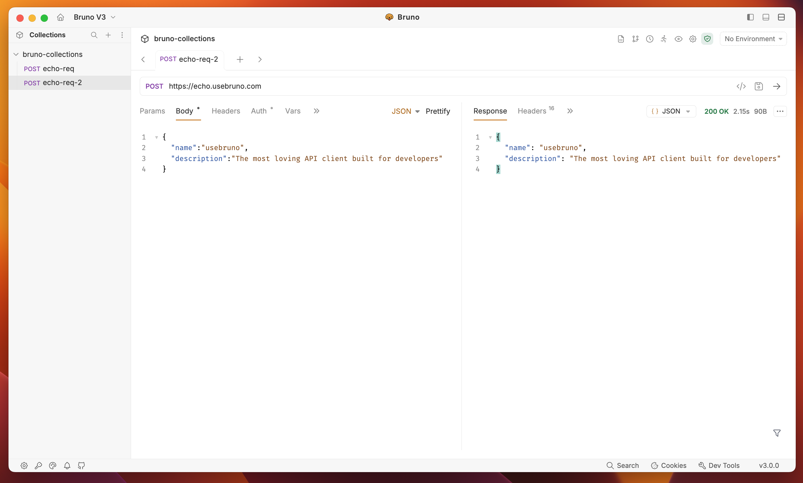
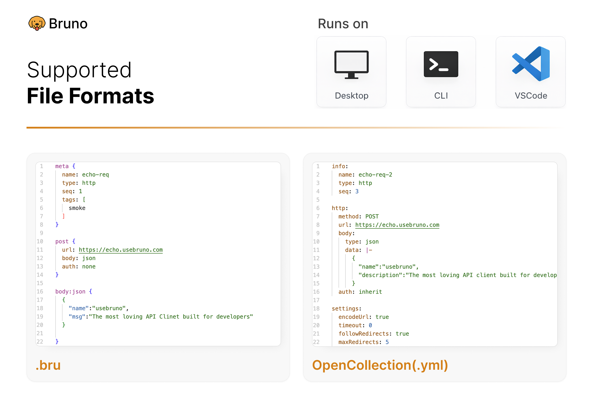
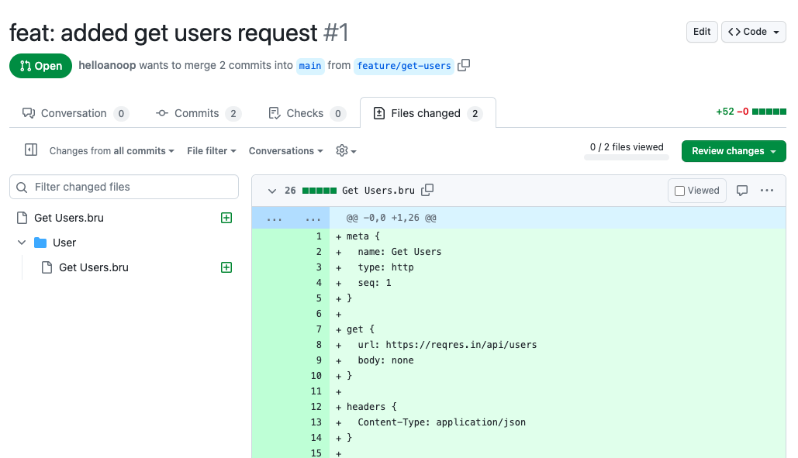

<br />


### Bruno - 开源 IDE，用于探索和测试 API。

[](https://badge.fury.io/gh/usebruno%bruno)
[](https://github.com/usebruno/bruno/actions/workflows/tests.yml)
[](https://github.com/usebruno/bruno/pulse)
[](https://twitter.com/use_bruno)
[](https://www.usebruno.com)
[](https://www.usebruno.com/downloads)

[English](../../readme.md)
| [Українська](./readme_ua.md)
| [Русский](./readme_ru.md)
| [Türkçe](./readme_tr.md)
| [Deutsch](./readme_de.md)
| [Français](./readme_fr.md)
| [Português (BR)](./readme_pt_br.md)
| [한국어](./readme_kr.md)
| [বাংলা](./readme_bn.md)
| [Español](./readme_es.md)
| [Italiano](./readme_it.md)
| [Română](./readme_ro.md)
| [Polski](./readme_pl.md)
| **简体中文**
| [正體中文](./readme_zhtw.md)
| [العربية](./readme_ar.md)
| [日本語](./readme_ja.md)
| [ქართული](./readme_ka.md)

Bruno 是一款全新且创新的 API 客户端，旨在颠覆 Postman 和其他类似工具。

Bruno 直接在您的电脑文件夹中存储您的 API 信息。我们使用纯文本标记语言 Bru 来保存有关 API 的信息。

您可以使用 Git 或您选择的任何版本控制系统来对您的 API 信息进行版本控制和协作。

Bruno 仅限离线使用。我们计划永不向 Bruno 添加云同步功能。我们重视您的数据隐私，并认为它应该留在您的设备上。阅读我们的长期愿景 [点击查看](https://github.com/usebruno/bruno/discussions/269)

[下载 Bruno](https://www.usebruno.com/downloads)

📢 观看我们在印度 FOSS 3.0 会议上的最新演讲 [点击查看](https://www.youtube.com/watch?v=7bSMFpbcPiY)

 <br /><br />

## 商业版本 ✨

我们的大多数功能都是免费且开源的。
我们致力于在 [开源与可持续性发展](https://github.com/usebruno/bruno/discussions/269) 之间取得和谐的平衡

欢迎使用我们的 [付费版本](https://www.usebruno.com/pricing) ，看看附加的功能是否对您或团队有所帮助！ <br/>

## 目录
- [安装](#安装)
- [特性](#特性)
    - [跨平台使用 🖥️](#跨平台使用-)
    - [通过Git协作 👩‍💻🧑‍💻](#通过git协作-)
- [重要链接 📌](#重要链接-)
- [展示 🎥](#展示-)
- [分享评价 📣](#分享评价-)
- [发布到新的包管理器](#发布到新的包管理器)
- [联系方式 🌐](#联系方式-)
- [商标](#商标)
- [贡献 👩‍💻🧑‍💻](#贡献-)
- [作者](#作者)
- [许可证 📄](#许可证-)

## 安装

Bruno 可以在我们的 [网站上下载](https://www.usebruno.com/downloads) 适用于Mac、Windows 和 Linux 的可执行文件。

您也可以通过包管理器如 Homebrew、Chocolatey、Scoop、Snap 和 Apt 安装 Bruno。

```sh
# 在 Mac 电脑上用 Homebrew 安装
brew install bruno

# 在 Windows 上用 Chocolatey 安装
choco install bruno

# 在 Windows 上用 Scoop 安装
scoop bucket add extras
scoop install bruno

# 在 Windows 上用 winget 安装
winget install Bruno.Bruno

# 在 Linux 上用 Snap 安装
snap install bruno

# 在 Linux 上用 Flatpak 安装
flatpak install com.usebruno.Bruno

# 在 Linux 上用 Apt 安装
sudo mkdir -p /etc/apt/keyrings
sudo apt update && sudo apt install gpg
sudo gpg --list-keys
sudo gpg --no-default-keyring --keyring /etc/apt/keyrings/bruno.gpg --keyserver keyserver.ubuntu.com --recv-keys 9FA6017ECABE0266
echo "deb [arch=amd64 signed-by=/etc/apt/keyrings/bruno.gpg] http://debian.usebruno.com/ bruno stable" | sudo tee /etc/apt/sources.list.d/bruno.list
sudo apt update && sudo apt install bruno
```

## 特性

### 跨平台使用 🖥️

 <br /><br />

### 通过Git协作 👩‍💻🧑‍💻

或者任何您选择的版本控制系统

 <br /><br />

## 重要链接 📌

- [我们的愿景](https://github.com/usebruno/bruno/discussions/269)
- [路线图](https://www.usebruno.com/roadmap)
- [文档](https://docs.usebruno.com)
- [Stack Overflow](https://stackoverflow.com/questions/tagged/bruno)
- [网站](https://www.usebruno.com)
- [价格](https://www.usebruno.com/pricing)
- [下载](https://www.usebruno.com/downloads)

## 展示 🎥

- [Testimonials](https://github.com/usebruno/bruno/discussions/343)
- [Knowledge Hub](https://github.com/usebruno/bruno/discussions/386)
- [Scriptmania](https://github.com/usebruno/bruno/discussions/385)

## 分享评价 📣

如果 Bruno 在您的工作和团队中帮助了您，请不要忘记在我们的 GitHub 讨论上分享您的 [评价](https://github.com/usebruno/bruno/discussions/343)

## 发布到新的包管理器

如需了解更多信息，请参见 [此处](../publishing/publishing_cn.md) 。

## 联系方式 🌐

[𝕏 (Twitter)](https://twitter.com/use_bruno) <br />
[Website](https://www.usebruno.com) <br />
[Discord](https://discord.com/invite/KgcZUncpjq) <br />
[LinkedIn](https://www.linkedin.com/company/usebruno)

## 商标

**名称**

`Bruno` 是由 [Anoop M D](https://www.helloanoop.com/) 持有的商标。

**Logo**

Logo 源自 [OpenMoji](https://openmoji.org/library/emoji-1F436/). License: CC [BY-SA 4.0](https://creativecommons.org/licenses/by-sa/4.0/)

## 贡献 👩‍💻🧑‍💻

很高兴您希望改进 bruno。请查看 [贡献指南](../contributing/contributing_cn.md)。

即使您无法通过代码做出贡献，我们仍然欢迎您提出 BUG 和新的功能需求。

## 作者

<div align="center">
    <a href="https://github.com/usebruno/bruno/graphs/contributors">
        
    </a>
</div>

## 许可证 📄

[MIT](../../license.md)
