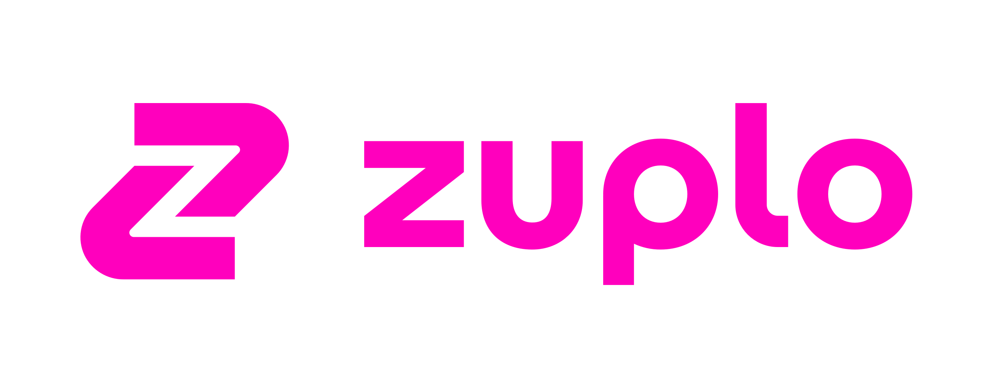

<br />


### Bruno - API の検証・動作テストのためのオープンソース IDE.

[](https://badge.fury.io/gh/usebruno%2Fbruno)
[](https://github.com/usebruno/bruno/actions/workflows/tests.yml)
[](https://github.com/usebruno/bruno/pulse)
[](https://twitter.com/use_bruno)
[](https://www.usebruno.com)
[](https://www.usebruno.com/downloads)

[English](../../readme.md)
| [Українська](./readme_ua.md)
| [Русский](./readme_ru.md)
| [Türkçe](./readme_tr.md)
| [Deutsch](./readme_de.md)
| [Français](./readme_fr.md)
| [Português (BR)](./readme_pt_br.md)
| [한국어](./readme_kr.md)
| [বাংলা](./readme_bn.md)
| [Español](./readme_es.md)
| [Italiano](./readme_it.md)
| [Română](./readme_ro.md)
| [Polski](./readme_pl.md)
| [简体中文](./readme_cn.md)
| [正體中文](./readme_zhtw.md)
| [العربية](./readme_ar.md)
| **日本語**
| [ქართული](./readme_ka.md)

Bruno は革新的な API クライアントです。Postman を代表する API クライアントツールの現状に一石を投じることを目指しています。

Bruno はローカルフォルダに直接コレクションを保存します。API リクエストの情報を保存するために Bru というプレーンテキストのマークアップ言語を採用しています。

Git や任意のバージョン管理システムを使って API コレクションを共同開発することもできます。

Bruno はオフラインのみで利用できます。Bruno にクラウド同期機能を追加する予定はありません。私たちはデータプライバシーを尊重しており、データはローカルに保存されるべきだと考えています。私たちの長期的なビジョンは[こちら](https://github.com/usebruno/bruno/discussions/269)をご覧ください。

[Bruno をダウンロード](https://www.usebruno.com/downloads)

📢 India FOSS 3.0 Conference での発表の様子は[こちら](https://www.youtube.com/watch?v=7bSMFpbcPiY)から

 <br /><br />

### インストール方法

Bruno は[私たちのウェブサイト](https://www.usebruno.com/downloads)からバイナリをダウンロードできます。Mac, Windows, Linux に対応しています。

Homebrew, Chocolatey, Scoop, Snap, Flatpak, Apt などのパッケージマネージャからもインストール可能です。

```sh
# MacでHomebrewを使ってインストール
brew install bruno

# WindowsでChocolateyを使ってインストール
choco install bruno

# WindowsでScoopを使ってインストール
scoop bucket add extras
scoop install bruno

# Windowsでwingetを使ってインストール
winget install Bruno.Bruno

# LinuxでSnapを使ってインストール
snap install bruno

# LinuxでFlatpakを使ってインストール
flatpak install com.usebruno.Bruno

# LinuxでAptを使ってインストール
sudo mkdir -p /etc/apt/keyrings
sudo apt update && sudo apt install gpg curl
curl -fsSL "https://keyserver.ubuntu.com/pks/lookup?op=get&search=0x9FA6017ECABE0266" \
  | gpg --dearmor \
  | sudo tee /etc/apt/keyrings/bruno.gpg > /dev/null
sudo chmod 644 /etc/apt/keyrings/bruno.gpg
echo "deb [arch=amd64 signed-by=/etc/apt/keyrings/bruno.gpg] http://debian.usebruno.com/ bruno stable" \
  | sudo tee /etc/apt/sources.list.d/bruno.list
sudo apt update && sudo apt install bruno
```

### マルチプラットフォームでの実行に対応 🖥️

 <br /><br />

### Git との連携が可能 👩‍💻🧑‍💻

または任意のバージョン管理システムにも対応しています。

 <br /><br />

### スポンサー

#### ゴールドスポンサー


#### シルバースポンサー


#### ブロンズスポンサー

<a href="https://zuplo.link/bruno">
    
</a>

### 主要リンク 📌

- [私たちの長期ビジョン](https://github.com/usebruno/bruno/discussions/269)
- [ロードマップ](https://github.com/usebruno/bruno/discussions/384)
- [ドキュメント](https://docs.usebruno.com)
- [Stack Overflow](https://stackoverflow.com/questions/tagged/bruno)
- [ウェブサイト](https://www.usebruno.com)
- [料金設定](https://www.usebruno.com/pricing)
- [ダウンロード](https://www.usebruno.com/downloads)
- [Github スポンサー](https://github.com/sponsors/helloanoop).

### Showcase 🎥

- [体験談](https://github.com/usebruno/bruno/discussions/343)
- [ナレッジベース](https://github.com/usebruno/bruno/discussions/386)
- [スクリプト集](https://github.com/usebruno/bruno/discussions/385)

### サポート ❤️

もし Bruno を気に入っていただいて、オープンソースの活動を支援していただけるなら、[Github Sponsors](https://github.com/sponsors/helloanoop)でスポンサーになることを考えてみてください。

### 体験談のシェア 📣

Bruno が職場やチームで役立っているのであれば、[GitHub discussion 上であなたの体験談](https://github.com/usebruno/bruno/discussions/343)をシェアしていただくようお願いします。

### 新しいパッケージマネージャへの公開

詳しくは[こちら](../publishing/publishing_ja.md)をご覧ください。

### 連絡先 🌐

[𝕏 (Twitter)](https://twitter.com/use_bruno) <br />
[Website](https://www.usebruno.com) <br />
[Discord](https://discord.com/invite/KgcZUncpjq) <br />
[LinkedIn](https://www.linkedin.com/company/usebruno)

### 商標について

**名前**

`Bruno`は[Anoop M D](https://www.helloanoop.com/)は取得している商標です。

**ロゴ**

ロゴの出典は[OpenMoji](https://openmoji.org/library/emoji-1F436/)です。CC [BY-SA 4.0](https://creativecommons.org/licenses/by-sa/4.0/)でライセンスされています。

### 貢献するには 👩‍💻🧑‍💻

Bruno を改善していただけるのは歓迎です。[コントリビュートガイド](../contributing/contributing_ja.md)をご覧ください。

もしコードによる貢献ができない場合でも、あなたのユースケースを解決するために遠慮なくバグ報告や機能リクエストを出してください。

### 開発者

<div align="center">
    <a href="https://github.com/usebruno/bruno/graphs/contributors">
        
    </a>
</div>

### ライセンス 📄

[MIT](../../license.md)
