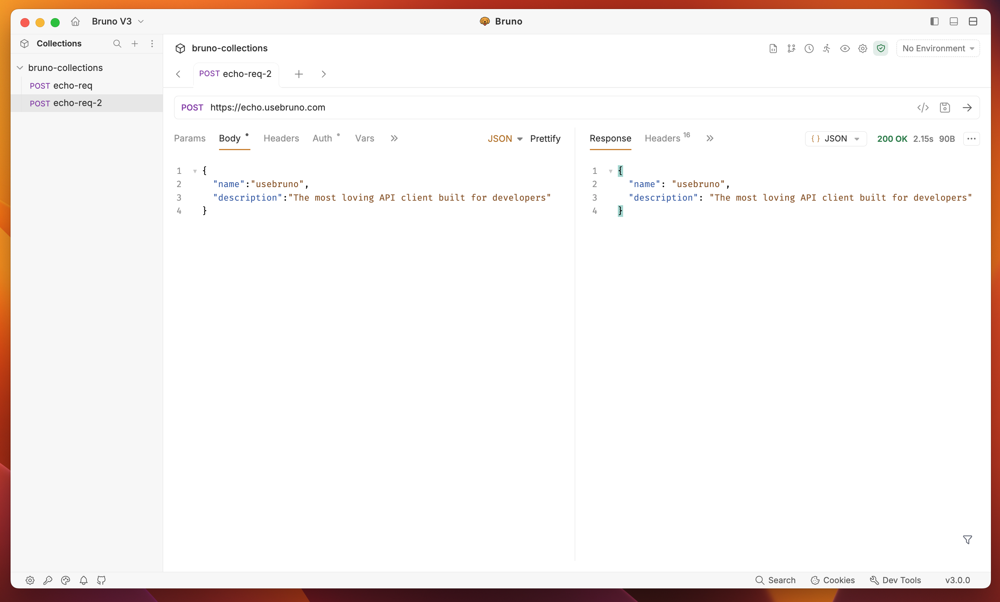

<br />


### ბრუნო - ღია წყაროების IDE API-ების შესწავლისა და ტესტირებისათვის.

[](https://badge.fury.io/gh/usebruno%2Fbruno)
[](https://github.com/usebruno/bruno/actions/workflows/tests.yml)
[](https://github.com/usebruno/bruno/pulse)
[](https://twitter.com/use_bruno)
[](https://www.usebruno.com)
[](https://www.usebruno.com/downloads)

[English](../../readme.md)
| [Українська](./readme_ua.md)
| [Русский](./readme_ru.md)
| [Türkçe](./readme_tr.md)
| [Deutsch](./readme_de.md)
| [Français](./readme_fr.md)
| [Português (BR)](./readme_pt_br.md)
| [한국어](./readme_kr.md)
| [বাংলা](./readme_bn.md)
| [Español](./readme_es.md)
| [Italiano](./readme_it.md)
| [Română](./readme_ro.md)
| [Polski](./readme_pl.md)
| [简体中文](./readme_cn.md)
| [正體中文](./readme_zhtw.md)
| [العربية](./readme_ar.md)
| [日本語](./readme_ja.md)
| **ქართული**

ბრუნო არის ახალი და ინოვაციური API კლიენტი, რომელიც მიზნად ისახავს პოსტმანისა და მსგავსი ინსტრუმენტების არსებული მდგომარეობის რევოლუციას.

ბრუნო თქვენი კოლექციების შენახვას უშუალოდ თქვენს ფაილური სისტემის ერთ-ერთ საქაღალოში ახდენს. ჩვენ ვხმარობთ უბრალო ტექსტურ მარკაპ ენის, Bru-ს, API მოთხოვნების შესახებ ინფორმაციის შენახვისთვის.

თქვენ შეგიძლიათ გამოიყენოთ Git ან ნებისმიერი ვერსიის კონტროლის სისტემა თქვენი API კოლექციების გასაზიარებლად.

ბრუნო მხოლოდ ოფლაინ რეჟიმში მუშაობს. ბრუნოში ღრუბლური სინქრონიზაციის დამატების გეგმები არ არის. ჩვენ ვაფასებთ თქვენი მონაცემების პრივატობას და creemos, რომ ისინი თქვენს მოწყობილობაში უნდა დარჩეს. წაიკითხეთ ჩვენი გრძელვადიანი ხედვა [აქ](https://github.com/usebruno/bruno/discussions/269)

[დამატებით ბრუნო](https://www.usebruno.com/downloads)

📢 შეიტყვეთ ჩვენი უახლესი საუბრის შესახებ India FOSS 3.0 კონფერენციაზე [აქ](https://www.youtube.com/watch?v=7bSMFpbcPiY)

 <br /><br />

### ინსტალაცია

ბრუნო ხელმისაწვდომია როგორც ბინარული ჩამოტვირთვა [ჩვენ的网站上](https://www.usebruno.com/downloads) Mac-ის, Windows-ისა და Linux-ისთვის.

თქვენ ასევე შეგიძლიათ დააინსტალიროთ ბრუნო პაკეტის მენეჯერების საშუალებით, როგორიცაა Homebrew, Chocolatey, Scoop, Snap, Flatpak და Apt.

```sh
# Mac-ზე Homebrew-ს საშუალებით
brew install bruno

# Windows-ზე Chocolatey-ს საშუალებით
choco install bruno

# Windows-ზე Scoop-ის საშუალებით
scoop bucket add extras
scoop install bruno

# Windows-ზე winget-ის საშუალებით
winget install Bruno.Bruno

# Linux-ზე Snap-ის საშუალებით
snap install bruno

# Linux-ზე Flatpak-ის საშუალებით
flatpak install com.usebruno.Bruno

# Linux-ზე Apt-ის საშუალებით
sudo mkdir -p /etc/apt/keyrings
sudo apt update && sudo apt install gpg curl
curl -fsSL "https://keyserver.ubuntu.com/pks/lookup?op=get&search=0x9FA6017ECABE0266" \
  | gpg --dearmor \
  | sudo tee /etc/apt/keyrings/bruno.gpg > /dev/null
sudo chmod 644 /etc/apt/keyrings/bruno.gpg
echo "deb [arch=amd64 signed-by=/etc/apt/keyrings/bruno.gpg] http://debian.usebruno.com/ bruno stable" \
  | sudo tee /etc/apt/sources.list.d/bruno.list
sudo apt update && sudo apt install bruno
```

### პლატფორმებს შორის მუშაობა 🖥️

 <br /><br />

### თანამშრომლობა Git-ის საშუალებით 👩‍💻🧑‍💻

ან ნებისმიერი ვერსიის კონტროლის სისტემის საშუალებით

 <br /><br />

### სპონსორები

#### ოქროს სპონსორები


#### ვერცხლის სპონსორები


#### ბრინჯის სპონსორები

<a href="https://zuplo.link/bruno">
    
</a>

### მნიშვნელოვანი ბმულები 📌

- [ჩვენი გრძელვადიანი ხედვა](https://github.com/usebruno/bruno/discussions/269)
- [გეგმა](https://github.com/usebruno/bruno/discussions/384)
- [დოკუმენტაცია](https://docs.usebruno.com)
- [Stack Overflow](https://stackoverflow.com/questions/tagged/bruno)
- [ვებსაიტი](https://www.usebruno.com)
- [ფასები](https://www.usebruno.com/pricing)
- [დამატება](https://www.usebruno.com/downloads)
- [GitHub სპონსორები](https://github.com/sponsors/helloanoop).

### ვიტრინა 🎥

- [მოწონებები](https://github.com/usebruno/bruno/discussions/343)
- [მეცნიერების ჰაბი](https://github.com/usebruno/bruno/discussions/386)
- [Scriptmania](https://github.com/usebruno/bruno/discussions/385)

### მხარდაჭერა ❤️

თუ გიყვართ ბრუნო და გინდათ მხარი დაუჭიროთ ჩვენს ღია წყაროების მუშაობას, გაითვალისწინეთ ჩვენი დახმარება [GitHub სპონსორების საშუალებით](https://github.com/sponsors/helloanoop).

### გააზიარეთ მოწმობები 📣

თუ ბრუნო დაგეხმარათ თქვენს სამუშაოში და გუნდებში, გთხოვთ, არ დაგავიწყდეთ ჩვენი [მოწონებების გაზიარება ჩვენს GitHub განხილვაში](https://github.com/usebruno/bruno/discussions/343)

### ახალი პაკეტის მენეჯერებში გამოქვეყნება

იხილეთ [აქ](../../publishing.md) მეტი ინფორმაციისათვის.

### დაინტერესდით 🌐

[𝕎 (Twitter)](https://twitter.com/use_bruno) <br />
[ვებსაიტი](https://www.usebruno.com) <br />
[Discord](https://discord.com/invite/KgcZUncpjq) <br />
[LinkedIn](https://www.linkedin.com/company/usebruno)

### სავაჭრო ნიშანი

**სახელი**

`ბრუნო` არის სავაჭრო ნიშანი, რომელსაც ფლობს [ანუპ მ. დ.](https://www.helloanoop.com/)

**ლოგო**

ლოგო არის [OpenMoji](https://openmoji.org/library/emoji-1F436/) სურათებიდან. ლიცენზია: CC [BY-SA 4.0](https://creativecommons.org/licenses/by-sa/4.0/)

### თანამშრომლობა 👩‍💻🧑‍💻

მიხარია, რომ დაინტერესებული ხართ ბრუნოს გაუმჯობესებით. გთხოვთ, გადახედეთ [თანამშრომლობის სახელმძღვანელოს](../../contributing.md)

თუნდაც ვერ მოახერხოთ კოდის საშუალებით კონტრიბუცია, ნუ ინანებთ პრობლემების და ფუნქციის მოთხოვნების ჩაწერას, რომლებიც უნდა განხორციელდეს თქვენი შემთხვევის გადასაჭრელად.

### ავტორები

<div align="center">
    <a href="https://github.com/usebruno/bruno/graphs/contributors">
        
    </a>
</div>

### ლიცენზია 📄

[MIT](../../license.md)