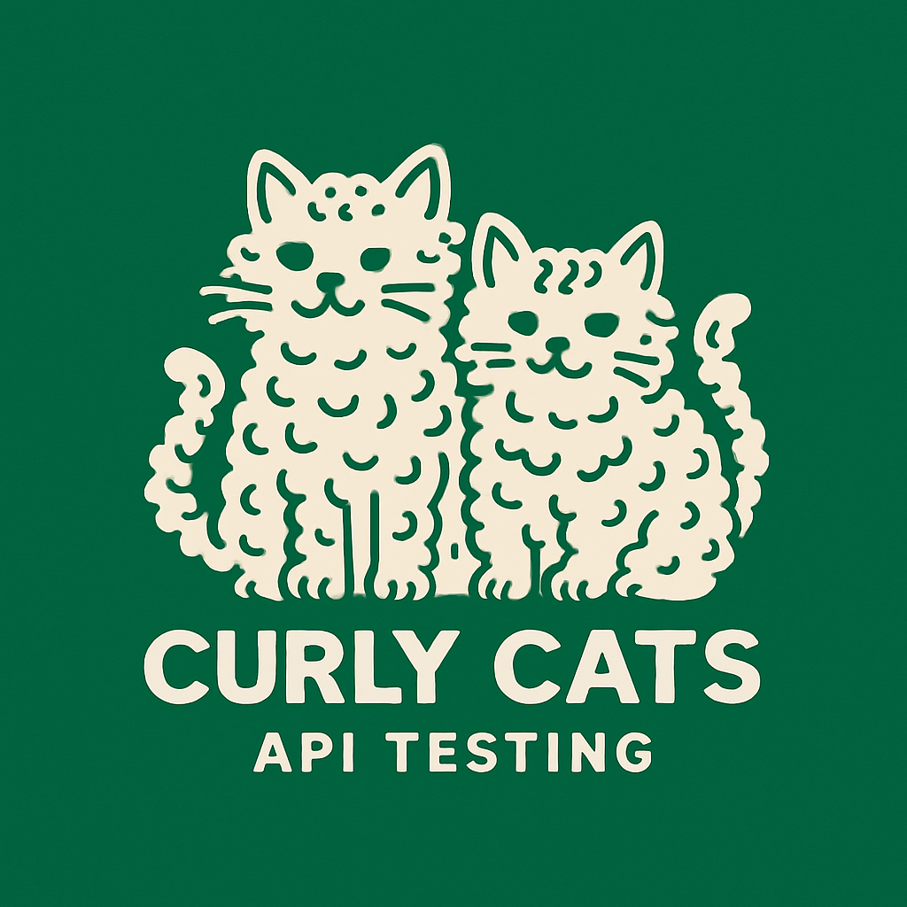

 

### Bruno - IDE із відкритим кодом для тестування та дослідження API

[English](../../readme.md)
| **Українська**
| [Русский](./readme_ru.md)
| [Türkçe](./readme_tr.md)
| [Deutsch](./readme_de.md)
| [Français](./readme_fr.md)
| [Português (BR)](./readme_pt_br.md)
| [한국어](./readme_kr.md)
| [বাংলা](./readme_bn.md)
| [हिन्दी](./readme_hi.md)
| [Español](./readme_es.md)
| [Italiano](./readme_it.md)
| [Română](./readme_ro.md)
| [Polski](./readme_pl.md)
| [简体中文](./readme_cn.md)
| [正體中文](./readme_zhtw.md)
| [العربية](./readme_ar.md)
| [日本語](./readme_ja.md)
| [ქართული](./readme_ka.md)

Bruno це новий та іноваційний API клієнт, націлений на революційну зміну статусy кво, запровадженого інструментами на кшталт Postman.

Bruno зберігає ваші колекції напряму у теці на вашому диску. Він використовує текстову мову розмітки Bru для збереження інформації про ваші API запити.

Ви можете використовувати git або будь-яку іншу систему контролю версій щоб спільно працювати над вашими колекціями API запитів.

Bruno є повністю автономним. Немає жодних планів додавати будь-які синхронізації через хмару, ніколи. Ми цінуємо приватність ваших даних, і вважаєм, що вони мають залишитись лише на вашому комп'ютері. Дізнатись більше про наше бачення у довготривалій перспективі можна [тут](https://github.com/usebruno/bruno/discussions/269)

   

### Кросплатформенність 🖥️

   

### Спільна робота через Git 👩‍💻🧑‍💻

Або будь-яку іншу систему контролю версій на ваш вибір

   

### Важливі посилання 📌

- [Наше бачення довготривалої перспективи проекту](https://github.com/usebruno/bruno/discussions/269)
- [Дорожня карта проекту](https://github.com/usebruno/bruno/discussions/384)
- [Документація](https://docs.usebruno.com)
- [Сайт](https://www.usebruno.com)
- [Завантаження](https://www.usebruno.com/downloads)

### Вітрина 🎥

- [Відгуки](https://github.com/usebruno/bruno/discussions/343)
- [Хаб знань](https://github.com/usebruno/bruno/discussions/386)
- [Scriptmania](https://github.com/usebruno/bruno/discussions/385)

### Підтримка ❤️

Гав! Якщо вам сподобався проект, тисніть на ⭐ !!

### Поділитись відгуками 📣

Якщо Bruno допоміг у роботі вам або вашій команді, будь ласка не забудьте поділитись вашими [відгуками у github дискусії](https://github.com/usebruno/bruno/discussions/343)

### Зробити свій внесок 👩‍💻🧑‍💻

Я радий що ви бажаєте покращити Bruno. Будь ласка переглянте [інструкцію по контрибуції](../contributing/contributing_ua.md)

Навіть якщо ви не можете зробити свій внесок пишучи код, будь ласка не соромтесь рапортувати про помилки і писати запити на новий функціонал, який потрібен вам у вашій роботі.

### Автори

    

### Залишайтесь на зв'язку 🌐

[Twitter](https://twitter.com/use_bruno)  
[Сайт](https://www.usebruno.com)  
[Discord](https://discord.com/invite/KgcZUncpjq)  
[LinkedIn](https://www.linkedin.com/company/usebruno)

### Ліцензія 📄

[MIT](../../license.md)
