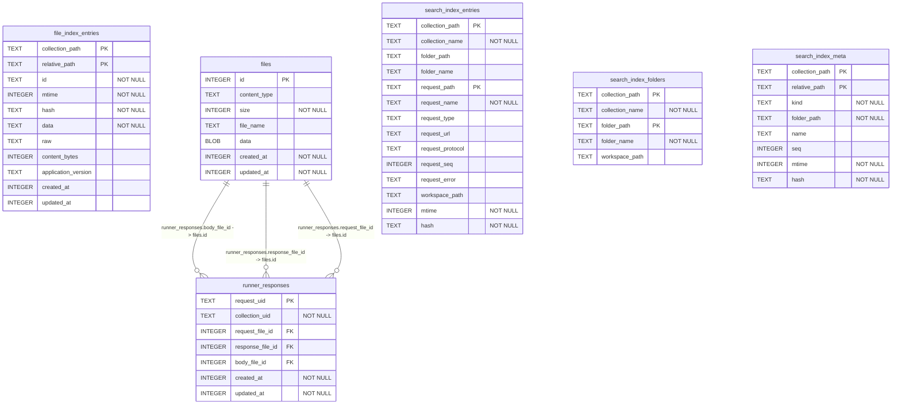

# @usebruno/sqlite schema

> Generated by `npm run schema` from `migrations/` — do not edit by hand.

Migrations applied: `0000001_runner_responses`, `0000002_file_index_entries`, `0000003_files`, `0000004_runner_response_files`, `0000005_search_index`

## `file_index_entries`

`WITHOUT ROWID`

| Column | Type | Not null | Default | Key |
|---|---|---|---|---|
| `collection_path` | TEXT | yes |  | PK (1) |
| `relative_path` | TEXT | yes |  | PK (2) |
| `id` | TEXT | yes |  |  |
| `mtime` | INTEGER | yes |  |  |
| `hash` | TEXT | yes |  |  |
| `data` | TEXT | yes |  |  |
| `raw` | TEXT |  |  |  |
| `content_bytes` | INTEGER |  |  |  |
| `application_version` | TEXT |  |  |  |
| `created_at` | INTEGER |  |  |  |
| `updated_at` | INTEGER |  |  |  |

**Indexes**

- `idx_file_index_lookup` on (`collection_path`, `relative_path`)

## `files`

| Column | Type | Not null | Default | Key |
|---|---|---|---|---|
| `id` | INTEGER |  |  | PK |
| `content_type` | TEXT |  |  |  |
| `size` | INTEGER | yes | `0` |  |
| `file_name` | TEXT |  |  |  |
| `data` | BLOB |  |  |  |
| `created_at` | INTEGER | yes | `unixepoch()` |  |
| `updated_at` | INTEGER | yes | `unixepoch()` |  |

## `runner_responses`

| Column | Type | Not null | Default | Key |
|---|---|---|---|---|
| `request_uid` | TEXT |  |  | PK |
| `collection_uid` | TEXT | yes |  |  |
| `request_file_id` | INTEGER |  |  |  |
| `response_file_id` | INTEGER |  |  |  |
| `body_file_id` | INTEGER |  |  |  |
| `created_at` | INTEGER | yes | `unixepoch()` |  |
| `updated_at` | INTEGER | yes | `unixepoch()` |  |

**Foreign keys**

- `body_file_id` → `files.id`
- `response_file_id` → `files.id`
- `request_file_id` → `files.id`

## `search_index_entries`

`WITHOUT ROWID`

| Column | Type | Not null | Default | Key |
|---|---|---|---|---|
| `collection_path` | TEXT | yes |  | PK (1) |
| `collection_name` | TEXT | yes |  |  |
| `folder_path` | TEXT |  |  |  |
| `folder_name` | TEXT |  |  |  |
| `request_path` | TEXT | yes |  | PK (2) |
| `request_name` | TEXT | yes |  |  |
| `request_type` | TEXT |  |  |  |
| `request_url` | TEXT |  |  |  |
| `request_protocol` | TEXT |  |  |  |
| `request_seq` | INTEGER |  |  |  |
| `request_error` | TEXT |  |  |  |
| `workspace_path` | TEXT |  |  |  |
| `mtime` | INTEGER | yes |  |  |
| `hash` | TEXT | yes |  |  |

## `search_index_folders`

`WITHOUT ROWID`

| Column | Type | Not null | Default | Key |
|---|---|---|---|---|
| `collection_path` | TEXT | yes |  | PK (1) |
| `collection_name` | TEXT | yes |  |  |
| `folder_path` | TEXT | yes |  | PK (2) |
| `folder_name` | TEXT | yes |  |  |
| `workspace_path` | TEXT |  |  |  |

## `search_index_meta`

`WITHOUT ROWID`

| Column | Type | Not null | Default | Key |
|---|---|---|---|---|
| `collection_path` | TEXT | yes |  | PK (1) |
| `relative_path` | TEXT | yes |  | PK (2) |
| `kind` | TEXT | yes |  |  |
| `folder_path` | TEXT | yes |  |  |
| `name` | TEXT |  |  |  |
| `seq` | INTEGER |  |  |  |
| `mtime` | INTEGER | yes |  |  |
| `hash` | TEXT | yes |  |  |

**Indexes**

- `idx_search_index_meta_lookup` on (`collection_path`, `kind`, `folder_path`)
