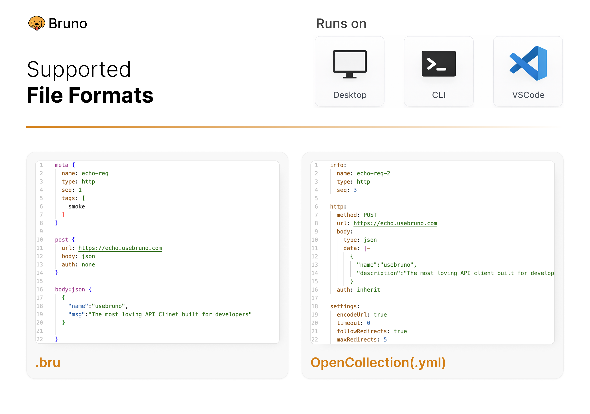
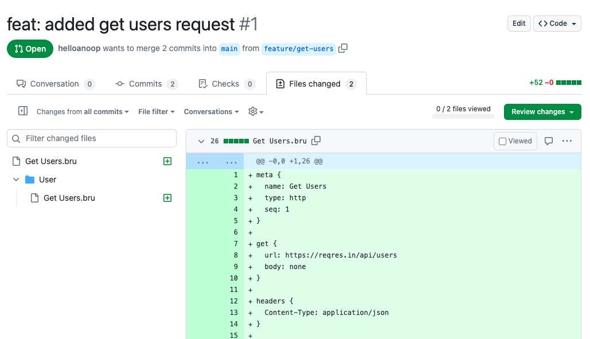

<br />


### Bruno - Opensource IDE for exploring and testing APIs.

[](https://badge.fury.io/gh/usebruno%bruno)
[](https://github.com/usebruno/bruno/actions/workflows/tests.yml)
[](https://github.com/usebruno/bruno/pulse)
[](https://twitter.com/use_bruno)
[](https://www.usebruno.com)
[](https://www.usebruno.com/downloads)

**English**
| [Українська](docs/readme/readme_ua.md)
| [Русский](docs/readme/readme_ru.md)
| [Türkçe](docs/readme/readme_tr.md)
| [Deutsch](docs/readme/readme_de.md)
| [Français](docs/readme/readme_fr.md)
| [Português (BR)](docs/readme/readme_pt_br.md)
| [한국어](docs/readme/readme_kr.md)
| [বাংলা](docs/readme/readme_bn.md)
| [Español](docs/readme/readme_es.md)
| [Italiano](docs/readme/readme_it.md)
| [Română](docs/readme/readme_ro.md)
| [Polski](docs/readme/readme_pl.md)
| [简体中文](docs/readme/readme_cn.md)
| [正體中文](docs/readme/readme_zhtw.md)
| [العربية](docs/readme/readme_ar.md)
| [日本語](docs/readme/readme_ja.md)
| [ქართული](docs/readme/readme_ka.md)
| [Nederlands](docs/readme/readme_nl.md)
| [فارسی](docs/readme/readme_fa.md)

Bruno is a new and innovative API client, aimed at revolutionizing the status quo represented by Postman and similar tools out there.

Bruno stores your collections directly in a folder on your filesystem. We use a plain text markup language, Bru, to save information about API requests.

You can use Git or any version control of your choice to collaborate over your API collections.

Bruno is offline-only. There are no plans to add cloud-sync to Bruno, ever. We value your data privacy and believe it should stay on your device. Read our long-term vision [here](https://github.com/usebruno/bruno/discussions/269)

[Download Bruno](https://www.usebruno.com/downloads)

📢 Watch our recent talk at India FOSS 3.0 Conference [here](https://www.youtube.com/watch?v=7bSMFpbcPiY)


 <br /><br />

## Commercial Versions ✨

Majority of our features are free and open source.
We strive to strike a harmonious balance between [open-source principles and sustainability](https://github.com/usebruno/bruno/discussions/269)

You can explore our [paid versions](https://www.usebruno.com/pricing) to see if there are additional features that you or your team may find useful! <br/>

## Table of Contents

- [Installation](#installation)
- [Features](#features)
  - [Run across multiple platforms 🖥️](#run-across-multiple-platforms-%EF%B8%8F)
  - [Collaborate via Git 👩‍💻🧑‍💻](#collaborate-via-git-%E2%80%8D%E2%80%8D)
- [Important Links 📌](#important-links-)
- [Showcase 🎥](#showcase-)
- [Share Testimonials 📣](#share-testimonials-)
- [Publishing to New Package Managers](#publishing-to-new-package-managers)
- [Stay in touch 🌐](#stay-in-touch-)
- [Trademark](#trademark)
- [Contribute 👩‍💻🧑‍💻](#contribute-%E2%80%8D%E2%80%8D)
- [Authors](#authors)
- [License 📄](#license-)

## Installation

Bruno is available as binary download [on our website](https://www.usebruno.com/downloads) for Mac, Windows and Linux.

You can also install Bruno via package managers like Homebrew, Chocolatey, Scoop, Snap, Flatpak and Apt.

```sh
# On Mac via Homebrew
brew install bruno

# On Windows via Chocolatey
choco install bruno

# On Windows via Scoop
scoop bucket add extras
scoop install bruno

# On Windows via winget
winget install Bruno.Bruno

# On Linux via Snap
snap install bruno

# On Linux via Flatpak
flatpak install com.usebruno.Bruno

# On Arch Linux via AUR
yay -S bruno

# On Linux via Apt
sudo mkdir -p /etc/apt/keyrings
sudo apt update && sudo apt install gpg curl
curl -fsSL "https://keyserver.ubuntu.com/pks/lookup?op=get&search=0x9FA6017ECABE0266" \
  | gpg --dearmor \
  | sudo tee /etc/apt/keyrings/bruno.gpg > /dev/null
sudo chmod 644 /etc/apt/keyrings/bruno.gpg
echo "deb [arch=amd64 signed-by=/etc/apt/keyrings/bruno.gpg] http://debian.usebruno.com/ bruno stable" \
  | sudo tee /etc/apt/sources.list.d/bruno.list
sudo apt update && sudo apt install bruno
```

## Features

### Run across multiple platforms 🖥️

 <br /><br />

### Collaborate via Git 👩‍💻🧑‍💻

Or any version control system of your choice

 <br /><br />

## Important Links 📌

- [Our Long Term Vision](https://github.com/usebruno/bruno/discussions/269)
- [Roadmap](https://www.usebruno.com/roadmap)
- [Documentation](https://docs.usebruno.com)
- [Stack Overflow](https://stackoverflow.com/questions/tagged/bruno)
- [Website](https://www.usebruno.com)
- [Pricing](https://www.usebruno.com/pricing)
- [Download](https://www.usebruno.com/downloads)

## Showcase 🎥

- [Testimonials](https://github.com/usebruno/bruno/discussions/343)
- [Knowledge Hub](https://github.com/usebruno/bruno/discussions/386)
- [Scriptmania](https://github.com/usebruno/bruno/discussions/385)

## Share Testimonials 📣

If Bruno has helped you at work and your teams, please don't forget to share your [testimonials on our GitHub discussion](https://github.com/usebruno/bruno/discussions/343)

## Publishing to New Package Managers

Please see [here](publishing.md) for more information.

## Stay in touch 🌐

[𝕏 (Twitter)](https://twitter.com/use_bruno) <br />
[Website](https://www.usebruno.com) <br />
[Discord](https://discord.com/invite/KgcZUncpjq) <br />
[LinkedIn](https://www.linkedin.com/company/usebruno)

## Trademark

**Name**

`Bruno` is a trademark held by [Anoop M D](https://www.helloanoop.com/)

**Logo**

The logo is sourced from [OpenMoji](https://openmoji.org/library/emoji-1F436/). License: CC [BY-SA 4.0](https://creativecommons.org/licenses/by-sa/4.0/)

## Contribute 👩‍💻🧑‍💻

I am happy that you are looking to improve bruno. Please check out the [contributing guide](contributing.md)

Even if you are not able to make contributions via code, please don't hesitate to file bugs and feature requests that needs to be implemented to solve your use case.

## Authors

<div align="center">
    <a href="https://github.com/usebruno/bruno/graphs/contributors">
        
    </a>
</div>

## License 📄

[MIT](license.md)
