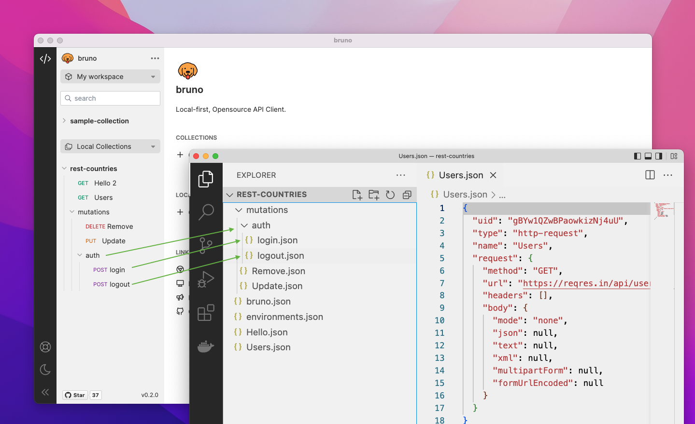

# bruno
Opensource IDE for exploring and testing api's.

### Bring Your Own Version Control ✨
Bruno is built from the ground up with the Local-first paradigm in mind. This allows developers to directly store there collections on top of their local filesystem. The collections are mirrored as folders and files on the filesystem.
<!--  -->

### Contribute 👩‍💻🧑‍💻
I am happy that you are looking to improve bruno. Please checkout the [contributing guide](contributing.md)

Even if you are not able to make contributions via code, please don't hesitate to file bugs and feature requests that needs to be implemented to solve your use case.

### Support ❤️ 
Woof! If you like project, hit that ⭐ button !!

### Authors

    

### Stay in touch 🌐
[Twitter](https://twitter.com/use_bruno)  
[Website](https://www.usebruno.com)  
[Discord](https://discord.com/invite/KgcZUncpjq)

### License 📄
[MIT](license.md)
