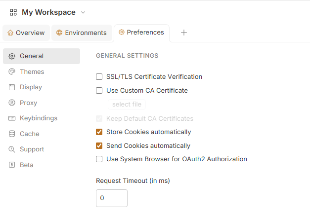
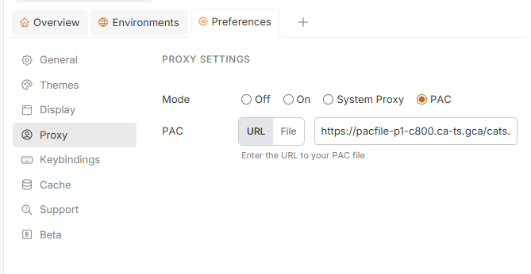

Bienvenue sur Curly CATS, l'adaptation de Bruno pour CATS.

Après avoir cloné le repo , faites `npm install` pour build le projet.

Si problème, ajouter les nodes modules suivant directement dans le projet au sein d'un répertoire node_modules placé à la racine : https://cacommun.sharepoint.com/:u:/r/sites/SquadTeDs-SolutionsTestse23/products/p1562_Outil_API_Testing/s4833_API_Testing/node_modules_electron.7z?csf=1&web=1&e=6RmjhK

Puis, jouer cette commande dans votre terminal powershell : $env:ELECTRON_SKIP_BINARY_DOWNLOAD="true"

Puis, relancer npm install

Une fois les packages téléchargés, on peut lancer `npm run build:packages`.

Il faut ensuite packager les librairies sandbox (facultatif) `npm run sandbox:bundle-libraries --workspace=packages/bruno-js`

Vous pouvez finalement faire `npm run dev` pour démarrer Curly CATS.

Pour activer l'assistant AI, voici les commandes à  jouer dans votre terminal powershell : 
$env:CURLY_XCO_URL="disponible_dans_kee_pass"
$env:CURLY_XCO_CLIENT_ID="disponible_dans_kee_pass"
$env:CURLY_XCO_CLIENT_SECRET="disponible_dans_kee_pass"
$env:CURLY_AI_API_URL="disponible_dans_kee_pass"
$env:CURLY_AI_MODEL_SUBSCRIPTION_ID="disponible_dans_kee_pass"

Une fois que l'application est lancée en local -> décocher le SSL dans l'applicatif

Et modifier le paramètre pour indiquer le fichier proxy pac https://pacfile-p1-c800.ca-ts.gca/cats.pac

