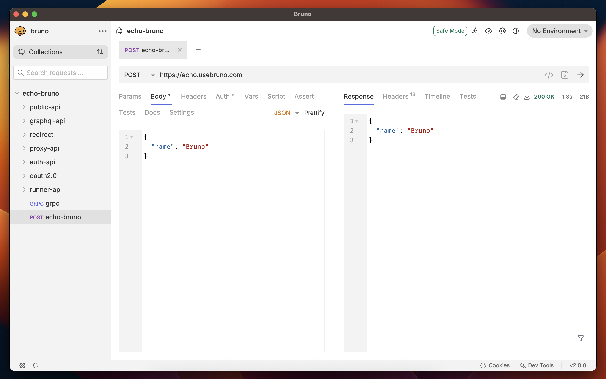

### Bruno - IDE Open Source pour explorer et tester les API.

[English](/readme.md) | [Українська](/readme_ua.md) | [Русский](/readme_ru.md) | [Türkçe](/readme_tr.md) | [Deutsch](/readme_de.md) | **Français**

Bruno est un nouveau et innovant client API, conçu pour révolutionner le statu quo représenté par Postman et outils similaires.

Bruno stocke vos collections directement dans un dossier sur votre système de fichiers. Nous utilisons un langage de balisage en texte brut, le Bru, pour enregistrer des informations sur les requêtes API.

Vous pouvez utiliser git ou tout système de contrôle de version de votre choix pour collaborer sur vos collections API.

Bruno fonctionne uniquement hors ligne uniquement. Il n'y a aucun plan pour ajouter une synchronisation dans le cloud à Bruno, jamais. Nous accordons de l'importance à la confidentialité de vos données et pensons qu'elles devraient rester sur votre appareil. Lisez notre vision à long terme [ici](https://github.com/usebruno/bruno/discussions/269)

   

### Fonctionne sur plusieurs plates-formes 🖥️

   

### Collaboration via Git 👩‍💻🧑‍💻

Ou tout système de contrôle de version de votre choix

   

### Liens Importants 📌

- [Notre Vision à Long Terme](https://github.com/usebruno/bruno/discussions/269)
- [Feuille de route](https://github.com/usebruno/bruno/discussions/384)
- [Documentation](https://docs.usebruno.com)
- [Site Web](https://www.usebruno.com)
- [Tarification](https://www.usebruno.com/pricing)
- [Téléchargement](https://www.usebruno.com/downloads)

### Présentation 🎥

- [Témoignages](https://github.com/usebruno/bruno/discussions/343)
- [Hub de Connaissances](https://github.com/usebruno/bruno/discussions/386)
- [Scriptmania](https://github.com/usebruno/bruno/discussions/385)

### Soutien ❤️

Wouf ! Si vous aimez le projet, cliquez sur le bouton ⭐ !!

### Partagez vos témoignages 📣

Si Bruno vous a aidé dans votre travail et/ou vos équipes, n'oubliez pas de partager votre témoignage sur la [page discussion Github dédiée](https://github.com/usebruno/bruno/discussions/343)

### Publier Bruno sur un nouveau gestionnaire de paquets

Veuillez consulter [ceci](publishing.md) pour plus d'informations.

### Contribuer 👩‍💻🧑‍💻

Je suis heureux de voir que vous cherchez à améliorer Bruno. Merci de consulter le [guide de contribution](contributing_fr.md)

Même si vous n'êtes pas en mesure de contribuer directement via du code, n'hésitez pas à consigner les bogues et les demandes de nouvelles fonctionnalités pour résoudre vos cas d'usage !

### Auteurs

    

### Restons en contact 🌐

[Twitter](https://twitter.com/use_bruno)  
[Site Web](https://www.usebruno.com)  
[Discord](https://discord.com/invite/KgcZUncpjq)  
[LinkedIn](https://www.linkedin.com/company/usebruno)

### Marque déposée

**Nom**

`Bruno` est une marque déposée détenue par [Anoop M D](https://www.helloanoop.com/)

**Logo**

Le logo est issu de [OpenMoji](https://openmoji.org/library/emoji-1F436/).
Licence: CC [BY-SA 4.0](https://creativecommons.org/licenses/by-sa/4.0/)

### Licence 📄

[MIT](license.md)
